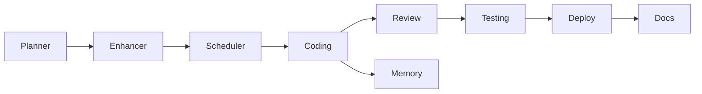
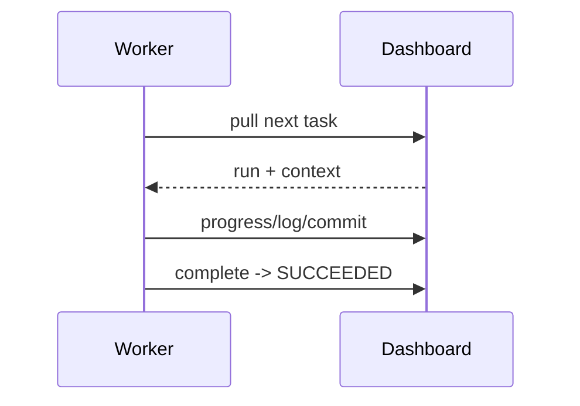

# Agents

Tata's "agents" are the AI capabilities along the pipeline. Generation agents
run server-side (deterministic stub LLM offline, real provider in production);
the **Coding** and **Self-heal** loops run inside the VS Code extension and use
the dashboard as a bridge. Specialist routing is handled by the **fleet
scheduler**.

## Planner Agent (Tech Spec)
- **Purpose** — analyse a free-text ticket into a structured spec.
- **Input** — ticket `source_text`. **Output** — versioned Tech Spec (feature, requirements, API, DB, risks, estimate).
- **Workflow** — `POST /tech-specs` → `POST /tech-specs/{id}/generate`; status → `ready`.
- **Example** — "Add CSV export" → spec JSON with API/DB/acceptance criteria.

## Enhancer Agent (OpenSpec)
- **Purpose** — expand a ready spec into 6 documents. **Input** — spec version. **Output** — proposal, requirements, tasks DAG, architecture, migration, checklist.
- **Workflow** — `POST /openspec/specs/{spec_id}/generate`.
- **Example** — bundle with a `tasks` artifact of keyed, dependency-ordered tasks.

## Scheduler (fleet)
- **Purpose** — route each task to a specialist. **Input** — task title/category. **Output** — role + agent.
- **Rules** — activity (review/test/docs) wins; else tech stack (flutter/python/node/drupal) beats category; else generalist.
- **Workflow** — `POST /fleet/seed` once, `POST /fleet/bundles/{id}/assign`, preview `POST /fleet/match`.

## Coding Agent (extension)
- **Purpose** — implement a task autonomously. **Input** — run + knowledge context. **Output** — committed code (no push).
- **Workflow** — plan → code → compile → fix → commit; recorded via `/agent/sessions/*`. Settings: `tata.compileCommand`, `tata.maxFixIterations`.

## Review Agent
- **Purpose** — review changes. **Input** — diff. **Output** — review status/summary via `/agent/tasks/{id}/review`.

## Testing Agent
- **Purpose** — generate a 7-kind test plan. **Input** — bundle. **Output** — suites/cases (docs). `POST /testgen/bundles/{id}/generate`.

## Memory Agent (knowledge graph)
- **Purpose** — store typed facts so agents fetch only relevant context. **Input** — bundle. **Output** — nodes/edges; `GET /knowledge/tasks/{id}/context`.

## Deployment Agent
- **Purpose** — ship a bundle. **Input** — webhook/manual. **Output** — versioned deployment, health, rollback. `POST /deploy/*`.

## Documentation Agent
- **Purpose** — produce docs/changelog. **Input** — bundle. **Output** — markdown (DOCUMENTATION category). Realised via specs/docs and the docs lane.

## Communication

See [MODELS.md](MODELS.md), [PROMPTS.md](PROMPTS.md), [API_REFERENCE.md](API_REFERENCE.md).
