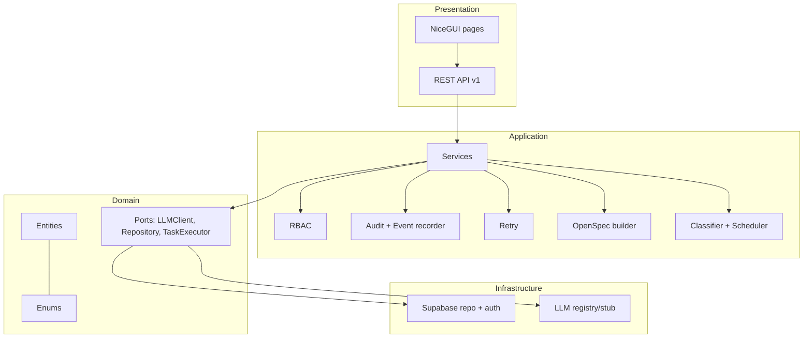
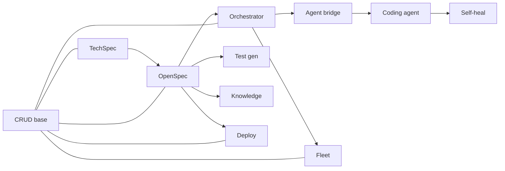

# Architecture

Tata is built as a single FastAPI process that serves both the REST API and the
NiceGUI dashboard, backed by Supabase (PostgreSQL + Auth) and bridged to VS Code
by a TypeScript extension. The backend follows **Clean Architecture** —
dependencies point inward.

## Principles

- **Clean Architecture** — `domain` ← `application` ← `infrastructure`/`presentation`.
- **Documentation, not code** — Phases 2–3 produce documents only; they never emit source.
- **Model-agnostic** — LLM providers are chosen per task via a port; nothing is hardcoded.
- **Cross-cutting by default** — RBAC, audit log, event log, retry and versioning live in the application layer.
- **Event-driven & stateful** — every unit of work has an explicit state and emits events.
- **Offline-first** — `StubLLMClient` and `StubTaskExecutor` keep the pipeline runnable and testable with no external services.

## Layered overview

## Backend layers (`dashboard/app/`)

| Layer | Folder | Responsibility |
|-------|--------|----------------|
| Core | `core/` | settings, JWT security, structured logging, exception hierarchy |
| Domain | `domain/` | entities, enums, ports (`llm`, `repositories`) — framework-free |
| Application | `application/` | services, RBAC, recorder, retry, OpenSpec/orchestration/deploy/knowledge builders |
| Infrastructure | `infrastructure/` | Supabase client/repo, auth adapter, realtime, LLM registry |
| Presentation | `presentation/` | REST API (`api/v1`) and NiceGUI UI (`ui/`) |

## Request lifecycle

1. A bearer JWT is verified (`core/security.py`); `X-Workspace-Id` scopes RBAC.
2. The router calls a service; the service calls `rbac.require(actor, perm, ws)`.
3. The service reads/writes via the Supabase repository (service role bypasses RLS server-side).
4. Mutations record an audit entry and emit an event for realtime sync.
5. Errors map to HTTP via the exception handlers.

## Ports & adapters

| Port (domain) | Adapter (infrastructure) | Offline default |
|---------------|--------------------------|-----------------|
| `LLMClient` | provider registry (`llm/client.py`) | `StubLLMClient` |
| `Repository` | `SupabaseRepository` | in-memory fakes (tests) |
| `TaskExecutor` | real executor | `StubTaskExecutor` |

## Pipeline by phase

| Phase | Theme | Input | Output |
|-------|-------|-------|--------|
| 1 | Foundation | — | Auth, RBAC, CRUD, monitoring |
| 2 | Tech Spec | free-text ticket | versioned structured spec |
| 3 | OpenSpec | spec version | 6-document bundle |
| 4 | Orchestration | tasks DAG | scheduled task runs |
| 5 | VS Code bridge | task runs | pull/push editor sync |
| 6 | Coding agent | task run | planned/compiled/committed code |
| 8 | Test generation | bundle | 7-kind test plan (docs) |
| 9 | Self-heal | run errors | gates loop to green + commit |
| 10 | Knowledge graph | bundle | typed nodes/edges, relevant context |
| 11 | Multi-agent fleet | task | specialist auto-assignment |
| 12 | Deploy & operate | bundle | versioned deployment + metrics |

## Service dependencies

Cross-cutting modules (RBAC, recorder, retry) are used by every service.

## See also

- [PROJECT_STRUCTURE.md](PROJECT_STRUCTURE.md) — folder-by-folder map
- [SERVICES.md](SERVICES.md) — each service in detail
- [DATABASE.md](DATABASE.md) — schema and tables
- [EVENT_SYSTEM.md](EVENT_SYSTEM.md) / [QUEUE.md](QUEUE.md) — observability
