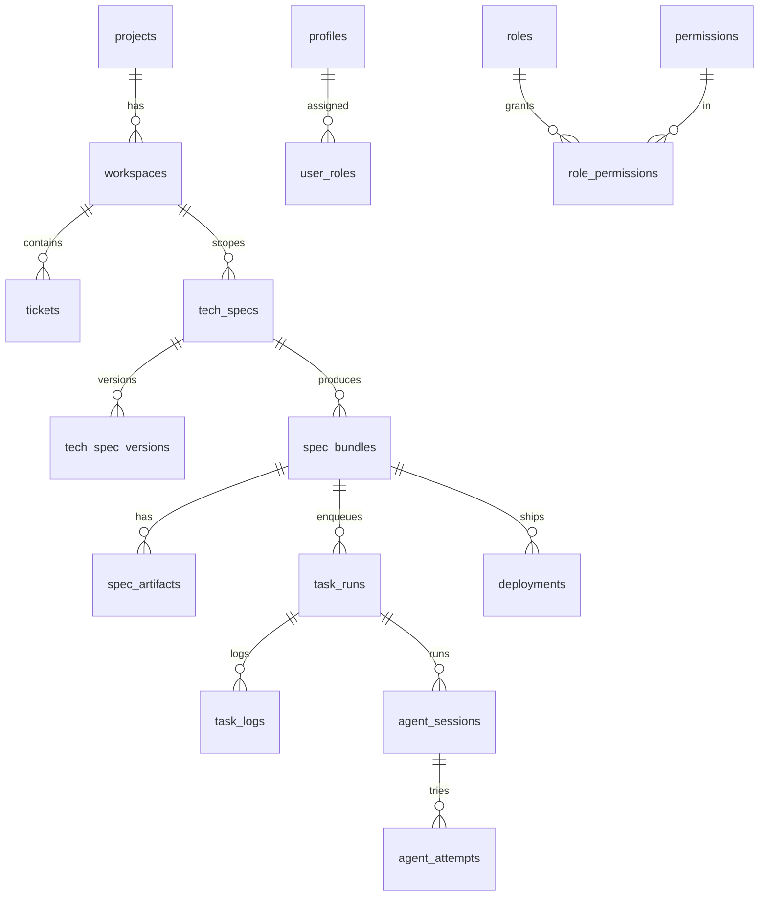

# Database

Tata uses Supabase PostgreSQL with Row-Level Security. Schema is created by 12
ordered migrations in `dashboard/migrations/`, applied `0001` → `0012`. The
server uses the **service-role** key (bypasses RLS); RLS protects direct client
access.

## Migrations (apply in order)

| File | Phase | Tables / changes |
|------|-------|------------------|
| `0001_schema.sql` | 1 | enums; profiles, roles, permissions, role_permissions, user_roles, projects, workspaces, tickets, prompts, prompt_versions, models, agents, workflows, event_log, task_queue, audit_log |
| `0002_rls.sql` | 1 | Row-Level Security policies |
| `0003_seed.sql` | 1 | roles (admin/manager/member), permissions, role-permission grants |
| `0004_tech_specs.sql` | 2 | tech_specs, tech_spec_versions |
| `0005_openspec.sql` | 3 | spec_bundles, spec_artifacts |
| `0006_orchestration.sql` | 4 | task_runs, task_logs |
| `0007_coding_agent.sql` | 6 | agent_sessions, agent_attempts |
| `0008_testgen.sql` | 8 | test_plans, test_suites, test_cases |
| `0009_self_heal.sql` | 9 | repair_sessions, repair_steps |
| `0010_knowledge.sql` | 10 | kg_nodes, kg_edges |
| `0011_agents.sql` | 11 | agent_role enum, agents.role, task_runs.role, seed fleet |
| `0012_deploy.sql` | 12 | deployments, backups, webhook_events |

```bash
for f in dashboard/migrations/00*.sql; do psql "$SUPABASE_DB_URL" -f "$f"; done
```

## Core entity-relationship



## Key tables

- **profiles** — mirrors `auth.users`; one row per user.
- **roles / permissions / role_permissions / user_roles** — RBAC; assignments are workspace-scoped (`workspace_id NULL` = global).
- **projects / workspaces / tickets** — core resources; ticket status/priority enums.
- **prompts / prompt_versions** — versioned prompt library (`current_version` pointer).
- **models / agents / workflows** — registries (`registry_status`).
- **tech_specs / tech_spec_versions** — source text + immutable generation history.
- **spec_bundles / spec_artifacts** — OpenSpec bundle + its 6 documents (`artifact_kind`).
- **task_runs / task_logs** — orchestrated runs (`run_state`, `depends_on` DAG, retry/timeout) + logs (`kind`: log/progress/commit/review/error/state).
- **agent_sessions / agent_attempts** — one coding-agent loop + plan/code/compile/fix/commit attempts.
- **test_plans / test_suites / test_cases** — documentation-only test plan.
- **repair_sessions / repair_steps** — self-heal gates.
- **kg_nodes / kg_edges** — knowledge graph.
- **deployments / backups / webhook_events** — deploy & operate.
- **event_log / task_queue / audit_log** — observability ([EVENT_SYSTEM.md](EVENT_SYSTEM.md), [QUEUE.md](QUEUE.md)).

## Conventions

- UUID primary keys (`gen_random_uuid()`), `created_at`/`updated_at` timestamptz.
- Enums mirror `domain/enums.py`. State machines via `run_state`, `spec_status`, etc.
- `jsonb` for flexible payloads (`config`, `payload`, `result`, `depends_on`).
- Cascade deletes follow ownership (project → workspace → ticket/run).

See [SUPABASE.md](SUPABASE.md) for RLS, keys, and auth.
