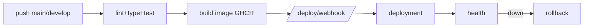

# Deployment

Tata ships as one image (`ghcr.io/<repo>/dashboard`) plus Prometheus + Grafana.
Deploys are versioned, triggered manually or by a webhook on a deployable branch,
health-checked, and reversible. Pipeline logic: `application/deploy/pipeline.py`.

## Environments

| Branch | Environment | Auto-deploy |
|--------|-------------|-------------|
| `main` / `master` | production | yes |
| `develop` / `staging` | staging | yes |
| other | dev | no |

Versions are deterministic: `<env>-<seq>` (e.g. `prod-0001`). Image tag adds short
sha: `repo:prod-0001-ab12cd3`.

## Development

```bash
cd dashboard && python -m app.main      # reload on, port 8080
```

## Staging / Production via Compose

```bash
cp dashboard/.env.example dashboard/.env   # production keys, APP_ENV=production
docker compose up -d --build               # dashboard + prometheus + grafana
```

Rolling updates are start-first with auto-rollback (see `docker-compose.yml`).

## Reverse proxy + HTTPS

Front the dashboard with nginx/Caddy. Caddy example (auto TLS):

```caddyfile
tata.example.com {
    reverse_proxy localhost:8080
}
```

Forward `/metrics` only to Prometheus; restrict Grafana (3000) and Prometheus
(9090) to an internal network.

## CI/CD

- **CI** (`.github/workflows/ci.yml`) — ruff, mypy, pytest.
- **CD** (`.github/workflows/cd.yml`) — build/push to GHCR, then POST `/api/v1/deploy/webhook`, smoke-check `/health`. Secrets: `DEPLOY_URL`, `DEPLOY_TOKEN`. GitLab equivalent: `.gitlab-ci.yml`.



## Scaling

`POST /deploy/deployments/{id}/scale {replicas}` (1..50). Replicas via Compose
`deploy.replicas` or an orchestrator.

## Backup / Restore / Rollback

| Action | Endpoint |
|--------|----------|
| Backup | `POST /deploy/backups {kind: database|artifacts|full}` |
| Restore | `POST /deploy/backups/{id}/restore` |
| Rollback | `POST /deploy/deployments/{id}/rollback` (last good) |

Health probes flip healthy/degraded/down; metrics feed Grafana. See
[DOCKER.md](DOCKER.md), [TROUBLESHOOTING.md](TROUBLESHOOTING.md).
