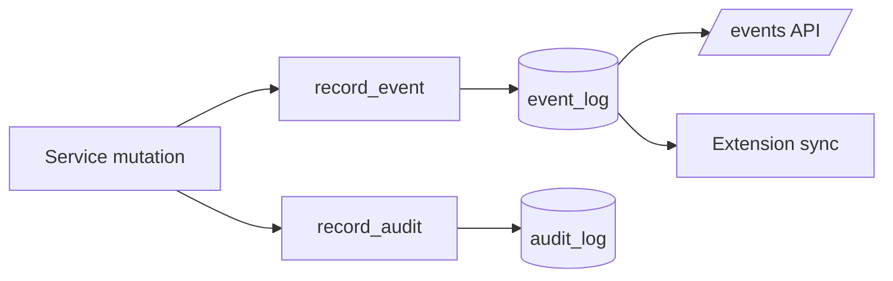

# Event System

Every significant action emits an event for monitoring and realtime sync, and
mutations write an audit record. Both are best-effort: a failure to record never
breaks the request (`application/recorder.py`).

## Event log

`record_event(event_type, source, workspace_id, payload)` inserts into `event_log`.
Consumers read via `GET /api/v1/events` and the extension polls task sync.

| Field | Meaning |
|-------|---------|
| `event_type` | e.g. `tech_spec.generated`, `run.state_changed`, `commit.pushed` |
| `source` | service name |
| `workspace_id` | scope |
| `payload` | jsonb detail |

## Audit log

`record_audit(actor_id, action, entity_type, entity_id, before, after)` →
`audit_log`. Actions: create, update, delete, rollback, generate, enqueue,
dispatch, cancel, resume. Read via `GET /api/v1/audit`.

## Flow

## Realtime sync

The VS Code worker polls `GET /agent/tasks/{id}` every `tata.syncIntervalMs` and
fires on state change — lightweight, no websockets. See [QUEUE.md](QUEUE.md),
[LOGGING.md](LOGGING.md).
