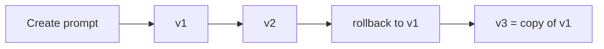

# Prompts

Prompts are first-class, versioned templates. Every change is a new immutable
version; `current_version` points to the active one and you can roll back.

## Data model

- **prompts** — `name, slug, description, status, current_version`.
- **prompt_versions** — `version, content, variables (jsonb), notes` (unique per prompt+version).

## API — `/api/v1/prompts`

| Method | Path | Purpose |
|--------|------|---------|
| GET/POST | `/prompts` | list/create |
| GET/PATCH/DELETE | `/prompts/{id}` | read/update/delete |
| GET | `/prompts/{id}/versions` | history |
| POST | `/prompts/{id}/versions` | add version (`content,variables,notes`) |
| POST | `/prompts/{id}/rollback` | `{version}` |

Permissions: `prompt:read`, `prompt:write`, `prompt:rollback`, `prompt:delete`.

## Lifecycle



Rollback creates a new version equal to the target, so history is never lost.

## Variables

`variables` declares template placeholders, e.g.:

```json
{ "content": "Analyse: {{ticket}} for {{workspace}}", "variables": {"ticket":"text","workspace":"name"} }
```

## Example

```bash
curl -X POST http://localhost:8080/api/v1/prompts -H "Authorization: Bearer $T" \
  -d '{"name":"Tech Spec","slug":"tech-spec","status":"active"}'
curl -X POST http://localhost:8080/api/v1/prompts/<id>/versions -H "Authorization: Bearer $T" \
  -d '{"content":"Produce a structured spec from {{ticket}}","notes":"v1"}'
```

Tech Spec generation can pass `prompt_id` to use a specific template — see
[MODELS.md](MODELS.md), [AGENTS.md](AGENTS.md).
