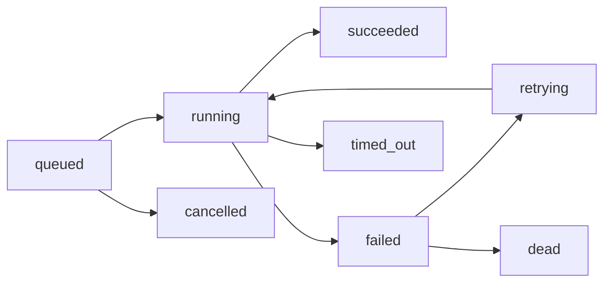

# Queue

Tata orchestrates OpenSpec tasks as `task_runs` (a DAG), not a generic broker.
A `task_queue` table also exists for foundation-level jobs. Runs carry retry,
timeout, priority, and dependencies.

## Task runs

`POST /orchestration/bundles/{id}/enqueue` reads the bundle's `tasks` artifact and
creates one run per task: `task_key`, `category`, `priority`, `depends_on`,
`max_attempts`, `timeout_seconds`.

## Worker pull

The extension claims the highest-priority ready run (deps satisfied) via
`POST /agent/tasks/next` (204 = none), then pushes progress/log/commit/complete.

## Controls

| Action | Endpoint |
|--------|----------|
| run | `POST /bundles/{id}/run {max_parallel}` |
| resume | `POST /bundles/{id}/resume` |
| cancel | `POST /runs/{id}/cancel` |
| logs | `GET /runs/{id}/logs` |

## Foundation queue

`task_queue` rows: `queue, task_type, state, attempts, max_attempts, payload,
available_at`. Read via `GET /api/v1/queue`. See [EVENT_SYSTEM.md](EVENT_SYSTEM.md).
