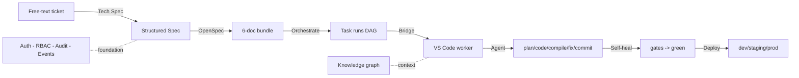

# Tata — AI Software Factory

Tata is a dashboard-driven platform that turns a **free-text ticket** into a
fully documented, orchestrated, and editor-bridged unit of work. A request
flows through a deterministic, offline-capable pipeline: **Ticket → Tech Spec →
OpenSpec (6 docs) → Task DAG → VS Code bridge → autonomous coding agent →
self-heal → deploy**. Every step is RBAC-guarded, audited, event-logged, and
versioned.

> New here? Start with [GETTING_STARTED.md](GETTING_STARTED.md), then read
> [ARCHITECTURE.md](ARCHITECTURE.md). For the full document index see the
> [Documentation map](#documentation-map) below.

---

## Features

- **Free-text → Tech Spec** — an LLM analyses a ticket into a structured,
  versioned specification (feature, requirements, API, DB, risks, estimate).
- **Tech Spec → OpenSpec** — six standard documents (proposal, requirements,
  tasks DAG, architecture, migration, checklist). Documentation only, never code.
- **Task orchestration** — the tasks DAG becomes scheduled `task_runs` with
  retry, timeout, priority, dependencies, parallelism, resume and cancel.
- **VS Code bridge** — a worker pulls tasks and pushes progress, logs, commits,
  reviews, errors, and completion. Realtime polling keeps the editor in sync.
- **Autonomous coding agent** — plan → code → compile → fix → commit, confined
  to the workspace, no push.
- **Self-healing loop** — compile/review/test gates loop to green, then commit.
- **Knowledge graph** — typed nodes/edges so the agent fetches only relevant
  context, never the whole source.
- **Multi-agent fleet** — a scheduler auto-assigns tasks to specialist agents.
- **Deploy & operate** — CI/CD, webhooks, health, rollback, scale, backup,
  restore, Prometheus metrics, Grafana dashboards.
- **Offline-first** — stub LLM and stub executor run the whole pipeline with no
  external keys, so development and tests are reproducible.

## Technology stack

| Layer | Technology |
|-------|-----------|
| API + UI | FastAPI 0.111, NiceGUI 2.0 (single process) |
| Language | Python 3.11 |
| Data | Supabase (PostgreSQL + RLS + Auth) via `supabase-py` 2.6 |
| Auth | Supabase JWT (HS256), `python-jose` |
| Models | Pydantic 2.7 / pydantic-settings |
| Logging | structlog |
| Editor bridge | VS Code extension (TypeScript 5.4) |
| Observability | Prometheus + Grafana |
| Containers | Docker, Docker Compose |
| Tooling | pytest, ruff, mypy |

## Architecture diagram



## Folder structure

```text
tata_tickets/
  dashboard/        Python FastAPI + NiceGUI + Supabase (API, UI, orchestration)
  extension/        VS Code extension (TypeScript) — pulls tasks, runs agent
  migrations/       SQL migrations 0001..0012 (in dashboard/)
  monitoring/       Prometheus + Grafana provisioning
  specs/            Phase specifications (1..12)
  docs/             This documentation set
  docker-compose.yml
  .github/workflows ci.yml + cd.yml
```

See [PROJECT_STRUCTURE.md](PROJECT_STRUCTURE.md) for the full tree.

## Quick start

```bash
# 1. Backend deps
cd dashboard && python -m venv .venv && source .venv/bin/activate
pip install -e ".[dev]"

# 2. Configure environment
cp .env.example .env   # then fill Supabase URL + keys (see ENVIRONMENT_VARIABLES.md)

# 3. Run API + UI on http://localhost:8080
python -m app.main

# 4. Run everything in containers (dashboard + Prometheus + Grafana)
cd .. && docker compose up --build
```

Full walkthrough: [GETTING_STARTED.md](GETTING_STARTED.md).

## Available commands

| Command | Where | Purpose |
|---------|-------|---------|
| `python -m app.main` | `dashboard/` | Start API + UI (port 8080) |
| `pytest -q` | `dashboard/` | Run the offline test suite |
| `ruff check app/` | `dashboard/` | Lint |
| `mypy app/` | `dashboard/` | Type-check |
| `npm run compile` | `extension/` | Build the extension |
| `npm run watch` | `extension/` | Rebuild on change |
| `docker compose up --build` | repo root | Dashboard + monitoring |

## Development workflow

1. Create a ticket → generate a Tech Spec → generate an OpenSpec bundle.
2. Enqueue the bundle → task runs appear in the orchestrator.
3. Open the extension, **Tata: Login**, **Pull Next Task**, **Run Autonomous Agent**.
4. The agent plans, codes, compiles, fixes, commits; the dashboard records it.
5. Push to `develop`/`main` → CI runs → CD builds the image and auto-deploys.

Details: [WORKFLOW.md](WORKFLOW.md).

## Production deployment

Build the image, run Compose behind a reverse proxy with HTTPS, point Prometheus
at `/metrics`, and auto-deploy from a GitHub/GitLab webhook on `main`/`develop`.
See [DEPLOYMENT.md](DEPLOYMENT.md) and [DOCKER.md](DOCKER.md).

## Documentation map

| Topic | Document |
|-------|----------|
| Architecture | [ARCHITECTURE.md](ARCHITECTURE.md) |
| Getting started | [GETTING_STARTED.md](GETTING_STARTED.md) |
| Installation | [INSTALLATION.md](INSTALLATION.md) |
| Folders | [PROJECT_STRUCTURE.md](PROJECT_STRUCTURE.md) |
| Services | [SERVICES.md](SERVICES.md) |
| Pipeline | [WORKFLOW.md](WORKFLOW.md) |
| Config | [ENVIRONMENT_VARIABLES.md](ENVIRONMENT_VARIABLES.md) |
| Database | [DATABASE.md](DATABASE.md) · [SUPABASE.md](SUPABASE.md) |
| REST API | [API_REFERENCE.md](API_REFERENCE.md) |
| AI agents | [AGENTS.md](AGENTS.md) · [MODELS.md](MODELS.md) · [PROMPTS.md](PROMPTS.md) |
| Events & queue | [EVENT_SYSTEM.md](EVENT_SYSTEM.md) · [QUEUE.md](QUEUE.md) |
| Logging | [LOGGING.md](LOGGING.md) |
| Deploy & Docker | [DEPLOYMENT.md](DEPLOYMENT.md) · [DOCKER.md](DOCKER.md) |
| Help | [TROUBLESHOOTING.md](TROUBLESHOOTING.md) · [FAQ.md](FAQ.md) |
| History | [CHANGELOG.md](CHANGELOG.md) |

## License

Released under the MIT License. See `LICENSE` at the repository root.
