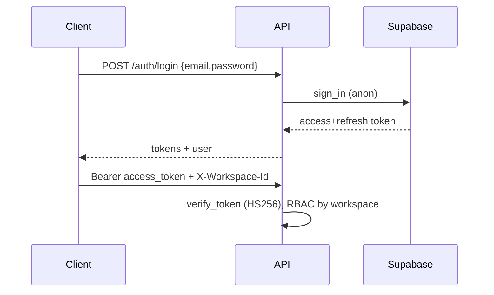

# Supabase

Supabase provides PostgreSQL, Auth (JWT), and Row-Level Security. Tata's backend
talks to it with two keys and verifies user tokens with the JWT secret.

## Keys & clients

| Key | Used by | Notes |
|-----|---------|-------|
| `SUPABASE_ANON_KEY` | login/auth (anon client) | public, RLS-bound |
| `SUPABASE_SERVICE_KEY` | server data access (service client) | secret, bypasses RLS |
| `SUPABASE_JWT_SECRET` | token verification (`core/security.py`) | HS256, audience `authenticated` |

`infrastructure/supabase/client.py` exposes `get_service_client()` and
`get_anon_client()`. Services use the service client; auth uses the anon client.

## Local setup

```bash
supabase start              # prints URL, anon key, service key, JWT secret, DB URL
# apply migrations
for f in dashboard/migrations/00*.sql; do psql "$SUPABASE_DB_URL" -f "$f"; done
```

Cloud: create a project, copy keys from **Project Settings → API**, set in `.env`.

## Auth flow



- `verify_token` decodes HS256 with the JWT secret; `sub` → `user_id`.
- `X-Workspace-Id` header scopes RBAC; `NULL`-workspace roles are global.

## RLS

`0002_rls.sql` enables RLS so direct client queries are workspace-scoped. The
backend uses the service role and enforces access in the **RBAC layer** instead,
keeping policy in one place ([API_REFERENCE.md](API_REFERENCE.md)).

## Tips

- Keep `SUPABASE_SERVICE_KEY` server-side only — never ship to the extension/UI.
- Rotate keys via the Supabase dashboard; update `.env` and restart.
- See [DATABASE.md](DATABASE.md) for tables and [TROUBLESHOOTING.md](TROUBLESHOOTING.md) for connection issues.
