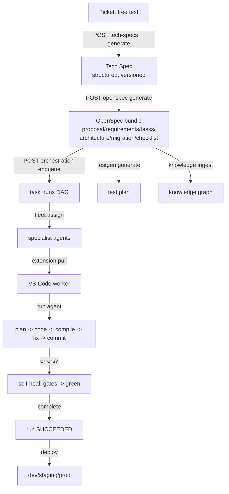
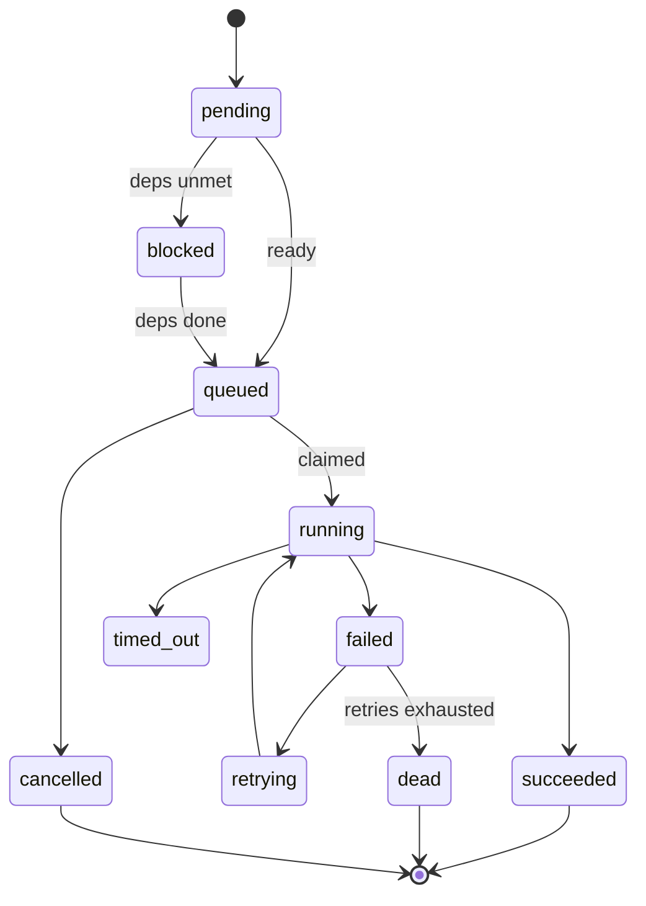
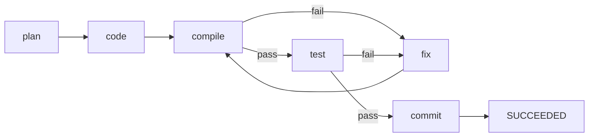

# Workflow

The end-to-end pipeline turns a free-text ticket into deployed, self-healed code.
Every stage is offline-capable (stub LLM / stub executor) and fully audited.

## Full pipeline

## Step by step

1. **Create a ticket** — `POST /api/v1/tickets`.
2. **Generate Tech Spec** — `POST /tech-specs` then `POST /tech-specs/{id}/generate` (versioned, status `ready`).
3. **Generate OpenSpec** — `POST /openspec/specs/{spec_id}/generate` → 6 artifacts.
4. **Ingest knowledge** — `POST /knowledge/bundles/{id}/ingest` for relevant context.
5. **Generate tests** — `POST /testgen/bundles/{id}/generate` (documentation).
6. **Enqueue** — `POST /orchestration/bundles/{id}/enqueue` → `task_runs` with classification.
7. **Assign fleet** — `POST /fleet/bundles/{id}/assign` to specialists.
8. **Bridge** — extension `Pull Next Task`, then `Run Autonomous Agent`.
9. **Agent loop** — plan/code/compile/fix/commit; pushes progress/log/commit.
10. **Self-heal** — on failure, gates loop to green then commit; run → `succeeded`.
11. **Deploy** — manual or webhook auto-deploy; health/rollback/scale.

## Run state machine

## Agent loop & self-heal

Continue with [AGENTS.md](AGENTS.md) for agent details and
[API_REFERENCE.md](API_REFERENCE.md) for the exact calls.
