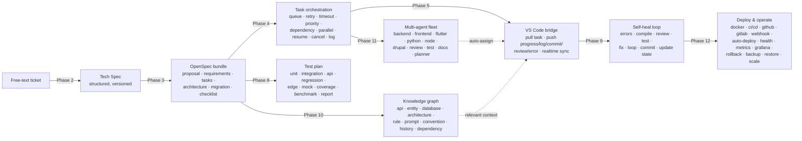

# Tata AI Software Factory — Specifications

This folder is the documentation home for the platform's phased delivery. Each
completed phase ships with a detailed specification (see the per-phase files).

Start with the [Overview](overview.md) for the end-to-end picture.

## The pipeline



## Phase status

| Phase | Theme | Output | Status |
|-------|-------|--------|--------|
| 1 | Foundation | Auth, RBAC, CRUD, monitoring | Done |
| 2 | Tech Spec generation | Free text → structured Tech Spec (versioned) | Done |
| 3 | OpenSpec generation | Tech Spec → standard OpenSpec documents | **Done** |
| 4 | Task orchestration | OpenSpec tasks → scheduled, controlled runs | **Done** |
| 5 | VS Code bridge | Pull/push bridge between dashboard and editor | **Done** |
| 6 | Autonomous coding agent | Plan → code → compile → fix → commit (no review) | **Done** |
| 7 | Code review & feedback | Read-only review across security/arch/perf/bugs | **Done** |
| 8 | Test generation | OpenSpec bundle → unit/integration/api/regression/edge/mock/coverage/benchmark + report | **Done** |
| 9 | Self-healing loop | Errors → compile/review/test → AI fix → loop → pass → commit → update state | **Done** |
| 10 | Knowledge graph | OpenSpec bundle → typed nodes/edges; agent fetches only relevant context | **Done** |
| 11 | Multi-agent fleet | Specialist agents (backend/frontend/flutter/python/node/drupal/review/test/docs/planner) + scheduler auto-assigns | **Done** |
| 12 | Deploy & operate | Docker/CI-CD/GitHub/GitLab/webhook/auto-deploy/health/metrics/Grafana/rollback/backup/restore/scale | **Done** |

Detailed specs:

- [Overview](overview.md)
- [Phase 1 — Foundation](phase-1-foundation.md)
- [Phase 2 — Tech Spec generation](phase-2-tech-spec.md)
- [Phase 3 — OpenSpec generation](phase-3-openspec.md)
- [Phase 4 — Task orchestration](phase-4-orchestration.md)
- [Phase 5 — VS Code bridge](phase-5-vscode-bridge.md)
- [Phase 6 — Autonomous coding agent](phase-6-coding-agent.md)
- [Phase 8 — Test generation](phase-8-test-generation.md)
- [Phase 9 — Self-healing loop](phase-9-self-heal.md)
- [Phase 10 — Knowledge Graph](phase-10-knowledge-graph.md)
- [Phase 11 — Multi-agent fleet](phase-11-multi-agent.md)
- [Phase 12 — Deploy & operate](phase-12-deploy.md)

## Architecture principles (apply to every phase)

- **Clean Architecture** — dependencies point inward (`domain` ←
  `application` ← `infrastructure`/`presentation`).
- **Documentation, not code** — Phases 2–3 produce documents only; they never
  emit source code.
- **Model-agnostic** — LLM providers are selected per task via a port; no model
  is hardcoded. The offline `StubLLMClient`/`StubTaskExecutor` keep everything
  runnable and testable without external services.
- **Cross-cutting by default** — RBAC, audit log, event log, retry, and
  versioning are enforced in the application layer, not bolted on per feature.
- **Event-driven & stateful** — every unit of work has an explicit state and
  emits events for monitoring and realtime sync.

## Data model added by Phases 3–9

| Table | Phase | Purpose |
|-------|-------|---------|
| `spec_bundles` | 3 | An OpenSpec change set generated from a Tech Spec version |
| `spec_artifacts` | 3 | The six documents of a bundle (markdown + structured data) |
| `task_runs` | 4 | One orchestrated execution of an OpenSpec task |
| `task_logs` | 4/5 | Log / progress / commit / review / error / state entries |
| `agent_sessions` | 6 | One run of the coding-agent loop for a task run |
| `agent_attempts` | 6 | Each plan/code/compile/fix/commit attempt within a session |
| `test_plans` | 8 | A test plan generated from an OpenSpec bundle |
| `test_suites` | 8 | Per-kind suites (unit/integration/api/regression/edge/mock/benchmark) |
| `test_cases` | 8 | Planned given/when/then cases within a suite |
| `repair_sessions` | 9 | One self-healing run for a task run (errors → fix → commit) |
| `repair_steps` | 9 | Each compile/review/test/fix/commit gate within a session |
| `agents.role` | 11 | Each agent's specialist role (backend … planner, generalist) |
| `task_runs.role` | 11 | The specialist role the scheduler assigned a run to |
| `deployments` | 12 | One versioned release of a bundle to an environment |
| `backups` | 12 | Database/artifacts snapshots for restore/rollback |
| `webhook_events` | 12 | Normalized GitHub/GitLab pushes that may auto-deploy |

Migrations: `0005_openspec.sql`, `0006_orchestration.sql`, `0007_coding_agent.sql`, `0008_testgen.sql`, `0009_self_heal.sql`, `0010_knowledge.sql`, `0011_agents.sql`, `0012_deploy.sql` (apply after `0004`).

## Tests

All phases are covered by offline tests (no live Supabase / LLM):

```bash
cd dashboard
.venv/Scripts/python.exe -m pytest -q
```

- `tests/test_security.py`, `tests/test_rbac.py`, `tests/test_crud_service.py` — Phase 1
- `tests/test_tech_spec.py` — Phase 2
- `tests/test_openspec.py` — Phase 3
- `tests/test_orchestrator.py` — Phase 4
- `tests/test_agent_bridge.py` — Phase 5
- `tests/test_coding_agent.py` — Phase 6
- `tests/test_testgen.py` — Phase 8
- `tests/test_self_heal.py` — Phase 9
- `tests/test_knowledge.py` — Phase 10
- `tests/test_fleet.py` — Phase 11
- `tests/test_deploy.py` — Phase 12