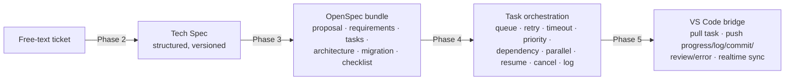

# Tata AI Software Factory — Specifications

This folder is the documentation home for the platform's phased delivery. Each
completed phase ships with a detailed specification (see the per-phase files).

Start with the [Overview](overview.md) for the end-to-end picture.

## The pipeline



## Phase status

| Phase | Theme | Output | Status |
|-------|-------|--------|--------|
| 1 | Foundation | Auth, RBAC, CRUD, monitoring | Done |
| 2 | Tech Spec generation | Free text → structured Tech Spec (versioned) | Done |
| 3 | OpenSpec generation | Tech Spec → standard OpenSpec documents | **Done** |
| 4 | Task orchestration | OpenSpec tasks → scheduled, controlled runs | **Done** |
| 5 | VS Code bridge | Pull/push bridge between dashboard and editor | **Done** |

Detailed specs:

- [Overview](overview.md)
- [Phase 1 — Foundation](phase-1-foundation.md)
- [Phase 2 — Tech Spec generation](phase-2-tech-spec.md)
- [Phase 3 — OpenSpec generation](phase-3-openspec.md)
- [Phase 4 — Task orchestration](phase-4-orchestration.md)
- [Phase 5 — VS Code bridge](phase-5-vscode-bridge.md)

## Architecture principles (apply to every phase)

- **Clean Architecture** — dependencies point inward (`domain` ←
  `application` ← `infrastructure`/`presentation`).
- **Documentation, not code** — Phases 2–3 produce documents only; they never
  emit source code.
- **Model-agnostic** — LLM providers are selected per task via a port; no model
  is hardcoded. The offline `StubLLMClient`/`StubTaskExecutor` keep everything
  runnable and testable without external services.
- **Cross-cutting by default** — RBAC, audit log, event log, retry, and
  versioning are enforced in the application layer, not bolted on per feature.
- **Event-driven & stateful** — every unit of work has an explicit state and
  emits events for monitoring and realtime sync.

## Data model added by Phases 3–5

| Table | Phase | Purpose |
|-------|-------|---------|
| `spec_bundles` | 3 | An OpenSpec change set generated from a Tech Spec version |
| `spec_artifacts` | 3 | The six documents of a bundle (markdown + structured data) |
| `task_runs` | 4 | One orchestrated execution of an OpenSpec task |
| `task_logs` | 4/5 | Log / progress / commit / review / error / state entries |

Migrations: `0005_openspec.sql`, `0006_orchestration.sql` (apply after `0004`).

## Tests

All phases are covered by offline tests (no live Supabase / LLM):

```bash
cd dashboard
.venv/Scripts/python.exe -m pytest -q
```

- `tests/test_security.py`, `tests/test_rbac.py`, `tests/test_crud_service.py` — Phase 1
- `tests/test_tech_spec.py` — Phase 2
- `tests/test_openspec.py` — Phase 3
- `tests/test_orchestrator.py` — Phase 4
- `tests/test_agent_bridge.py` — Phase 5
