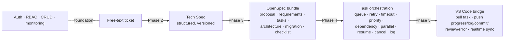

# Overview — Tata AI Software Factory

A dashboard-driven platform that turns a **free-text ticket** into a fully
documented, orchestrated, and editor-bridged unit of work. Every phase builds on
the one before it, and the whole pipeline runs offline (stub LLM / stub executor)
for development and tests.

## The pipeline



Phase 1 is the **foundation** — identity, access control, the resource registry,
and observability — that every later phase depends on.

## Phases at a glance

| Phase | Theme | Input | Output | Spec |
|-------|-------|-------|--------|------|
| 1 | Foundation | — | Auth, RBAC, CRUD, monitoring | [phase-1-foundation.md](phase-1-foundation.md) |
| 2 | Tech Spec generation | Free-text ticket | Structured, versioned Tech Spec | [phase-2-tech-spec.md](phase-2-tech-spec.md) |
| 3 | OpenSpec generation | Tech Spec version | Six-document OpenSpec bundle | [phase-3-openspec.md](phase-3-openspec.md) |
| 4 | Task orchestration | OpenSpec `tasks` DAG | Scheduled, controlled task runs | [phase-4-orchestration.md](phase-4-orchestration.md) |
| 5 | VS Code bridge | Task runs | Pull/push between editor & dashboard | [phase-5-vscode-bridge.md](phase-5-vscode-bridge.md) |

## Architecture principles (apply to every phase)

- **Clean Architecture** — dependencies point inward
  (`domain` ← `application` ← `infrastructure`/`presentation`).
- **Documentation, not code** — Phases 2–3 produce documents only; they never
  emit source code.
- **Model-agnostic** — LLM providers are selected per task via a port; no model
  is hardcoded. Offline `StubLLMClient` / `StubTaskExecutor` keep everything
  runnable and testable without external services.
- **Cross-cutting by default** — RBAC, audit log, event log, retry, and
  versioning are enforced in the application layer, not bolted on per feature.
- **Event-driven & stateful** — every unit of work has an explicit state and
  emits events for monitoring and realtime sync.

## Layout

```
dashboard/
  app/
    domain/          entities, enums, ports (LLM, repositories)
    application/     services, RBAC, retry, recorder, openspec/orchestration logic
    infrastructure/  Supabase, auth, LLM client, realtime
    presentation/    REST API (api/v1) + NiceGUI UI (ui/)
  migrations/        0001..0006 SQL (apply in order)
  tests/             offline tests per phase
extension/           VS Code bridge (TypeScript) — Phase 5
specs/               these documents
```

## Data model by phase

| Tables | Phase | Purpose |
|--------|-------|---------|
| `profiles`, `roles`, `permissions`, `role_permissions`, `user_roles` | 1 | Identity & RBAC |
| `projects`, `workspaces`, `tickets` | 1 | Core resources |
| `prompts`, `prompt_versions` | 1 | Versioned prompt library |
| `models`, `agents`, `workflows` | 1 | Registries |
| `event_log`, `task_queue`, `audit_log` | 1 | Observability |
| `tech_specs`, `tech_spec_versions` | 2 | Free-text → structured spec (versioned) |
| `spec_bundles`, `spec_artifacts` | 3 | OpenSpec change set + its six documents |
| `task_runs`, `task_logs` | 4/5 | Orchestrated runs + log/progress/commit/review/error/state |

Migrations apply in order: `0001` → `0002` (RLS) → `0003` (seed) → `0004` →
`0005` → `0006`.

## Run & test

```bash
cd dashboard
.venv/Scripts/python.exe -m pytest -q     # all phases, offline

# REST API + UI
uvicorn app.main:app --reload
```

| Test file | Phase |
|-----------|-------|
| `tests/test_security.py`, `tests/test_rbac.py`, `tests/test_crud_service.py` | 1 |
| `tests/test_tech_spec.py` | 2 |
| `tests/test_openspec.py` | 3 |
| `tests/test_orchestrator.py` | 4 |
| `tests/test_agent_bridge.py` | 5 |
