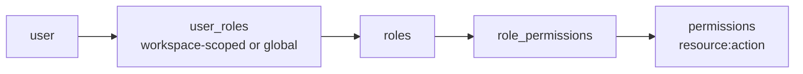

# Phase 1 — Dashboard Foundation

## Goal

Establish the platform's foundation: **authentication**, **role-based access
control (RBAC)**, the core **resource registry** with a generic CRUD engine, and
**observability** (event log, task queue, audit log). Every later phase builds on
these primitives.

| Capability | How it is provided |
|------------|--------------------|
| **Auth** | Supabase-backed login / refresh / me; Bearer access tokens |
| **RBAC** | Workspace-scoped role assignments → effective `resource:action` permissions |
| **CRUD** | One `CrudService` + router factory drive every standard resource |
| **Registries** | Models, agents, workflows, prompts (versioned) |
| **Observability** | `event_log`, `task_queue`, `audit_log` read-only views |
| **Auditing** | Every write records a before/after `audit_log` entry + event |

## Design

```
presentation/api/v1            REST surface (routers + crud_factory)
        │
application/services/*         CrudService, ProjectService, …, MonitoringService
application/rbac.py            RBAC engine (effective permissions, require())
application/recorder.py        record_audit / record_event (cross-cutting)
        │
infrastructure/                SupabaseAuthAdapter · SupabaseRepository · realtime
        │
domain/                        entities · enums · Repository port
```

- **Service base:** `app/application/services/base.py` → `CrudService` centralizes
  RBAC checks, workspace scoping, audit, and event recording so each resource
  service stays thin.
- **Router factory:** `routers/crud_factory.py` → `build_crud_router(...)`
  produces list/get/create/update/delete endpoints for any `CrudService`,
  given its create/update schemas.
- **Model-agnostic registries:** `models`, `agents`, and `workflows` store
  capability/config as `jsonb` — no model is hardcoded.

## Identity & RBAC

Permission codes follow **`resource:action`** (e.g. `ticket:write`,
`prompt:rollback`). RBAC resolves a user's effective permissions from
**workspace-scoped role assignments** (`user_roles`); an assignment with
`workspace_id = NULL` is **global**.



`RBAC.require(user_id, "ticket:write", workspace_id)` raises `AuthorizationError`
(403) when the permission is absent.

### Seeded roles (`migrations/0003_seed.sql`)

| Role | Grants |
|------|--------|
| `admin` | All permissions |
| `manager` | Everything except `role:write` |
| `member` | Read-only (`%:read`) |

## Data model (`migrations/0001_schema.sql`)

- **Identity & access:** `profiles` (mirrors `auth.users`), `roles`,
  `permissions`, `role_permissions`, `user_roles` (workspace-scoped).
- **Resources:** `projects`, `workspaces` (belong to a project), `tickets`
  (workspace-scoped, `ticket_status` / `ticket_priority` enums).
- **Prompt library:** `prompts` + `prompt_versions` (immutable versions,
  `current_version`, `registry_status`).
- **Registries:** `models` (provider + `model_key` + `config`), `agents`
  (capability `config`, optional `default_model_id`), `workflows`
  (event-driven step `definition`).
- **Observability:** `event_log`, `task_queue` (`task_state` enum), `audit_log`
  (actor, action, entity, before/after).

RLS is enabled in `0002_rls.sql` as a backstop; primary RBAC is enforced in the
application layer via the Supabase `service_role` client.

## REST API

| Method & path | Description |
|---------------|-------------|
| `POST /api/v1/auth/login` | Email/password → access + refresh token |
| `POST /api/v1/auth/refresh` | Exchange refresh token for a new session |
| `GET  /api/v1/auth/me` | Current authenticated identity |
| `GET/POST/PATCH/DELETE /api/v1/projects` | Projects CRUD |
| `… /api/v1/workspaces` | Workspaces CRUD |
| `… /api/v1/tickets` | Tickets CRUD |
| `… /api/v1/prompts` | Prompt library (+ versions / rollback) |
| `… /api/v1/models` | Model registry CRUD |
| `… /api/v1/agents` | Agent registry CRUD |
| `… /api/v1/workflows` | Workflow registry CRUD |
| `… /api/v1/roles` | Roles & permission management |
| `GET /api/v1/monitoring/events` | Recent `event_log` (needs `event:read`) |
| `GET /api/v1/monitoring/queue` | `task_queue` (needs `queue:read`) |
| `GET /api/v1/monitoring/audit` | `audit_log` (needs `audit:read`) |

Standard resource endpoints accept an optional `X-Workspace-Id` header for
workspace scoping (`optional_workspace` dependency).

## Cross-cutting behavior

- **Audit:** every create/update/delete records a before/after `audit_log` row.
- **Events:** state-changing actions emit an `event_log` entry consumed by the
  monitoring views and the realtime layer.
- **Workspace scoping:** list/get/write operations honor the active workspace so
  RBAC and data isolation align.

## UI

A NiceGUI presentation layer (`app/presentation/ui/`) provides login, an
overview, generic CRUD pages, and a monitoring page over the same services.

## Tests

- `tests/test_security.py` — token/auth context handling.
- `tests/test_rbac.py` — effective permissions, global vs workspace scope,
  `require()` enforcement.
- `tests/test_crud_service.py` — CRUD lifecycle, workspace scoping, audit/event
  recording, permission gating.
