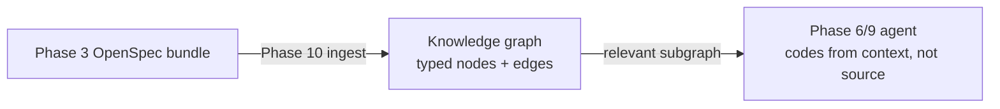
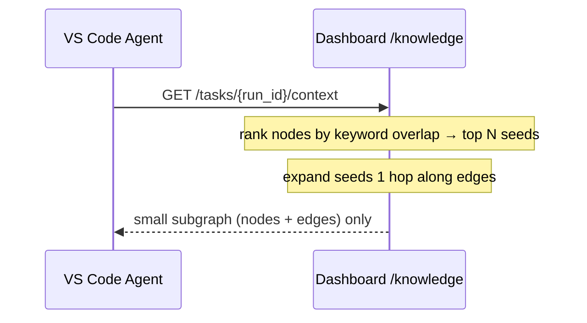

# Phase 10 — Knowledge Graph

## Goal

Build a **project knowledge graph** so the agent works from *relevant context*
instead of reading the whole source. Every fact the platform already produces is
stored as a typed node, with the relationships between them as edges:

> Nhận OpenSpec bundle → trích xuất API · Entity · Database · Architecture ·
> Business Rule · Prompt · Convention · History · Dependency → liên kết bằng
> cạnh → **Agent chỉ lấy context liên quan, không đọc toàn bộ source.**

| Stored as a node | What it captures |
|------------------|------------------|
| **API** | endpoints, contracts, surfaces |
| **Entity** | domain models / data structures |
| **Database** | tables, schemas, migrations |
| **Architecture** | components, layers, decisions |
| **Business Rule** | requirements / constraints |
| **Prompt** | versioned prompt templates |
| **Convention** | coding standards, patterns |
| **History** | changes, runs, past sessions |
| **Dependency** | external libs / services (and `depends_on` edges) |

## Pipeline position



The graph is **derived from documents only** — nodes store a short summary, tags
and a small payload, never whole source bodies. Ingest is deterministic and
pure, so it is reproducible and testable offline.

## Server — `KnowledgeGraphService`

`app/application/services/knowledge.py` ingests a bundle, upserts nodes/edges and
serves a scored, relevant subgraph. Ingest/query/link use the new
`knowledge:*` permissions; `context` reuses `agent:bridge` (same worker).

| Method & path | Description |
|---------------|-------------|
| `POST /api/v1/knowledge/bundles/{id}/ingest` | OpenSpec bundle → typed nodes + edges (idempotent) |
| `POST /api/v1/knowledge/query` | Relevant subgraph for free text + kinds, expanded N hops |
| `GET  /api/v1/knowledge/tasks/{run_id}/context` | The subgraph the agent fetches for a run |
| `GET/POST/PATCH/DELETE /api/v1/knowledge/nodes` | Node CRUD |
| `POST /api/v1/knowledge/edges` | Link two nodes |

## Relevant context, not whole source



Retrieval = keyword-overlap ranking over title/summary/key → top-`limit` seeds →
expand `hops` along edges → return just that subgraph. Bounded and small.

## Data model (`migrations/0010_knowledge.sql`)

- `kg_nodes(id, workspace_id, bundle_id, kind, key, title, summary, tags, data,
  …)` — `kind ∈ {api, entity, database, architecture, business_rule, prompt,
  convention, history, dependency}`, `unique(workspace_id, key)` for upsert.
- `kg_edges(id, workspace_id, source_id → kg_nodes, target_id → kg_nodes, kind,
  weight)` — `kind ∈ {depends_on, references, implements, owns, derived_from,
  relates_to}`, `unique(source_id, target_id, kind)`.
- Enums `knowledge_kind`, `knowledge_edge_kind`.
- Permissions `knowledge:read|write|delete|ingest` (member: read).

## Tests — `tests/test_knowledge.py`

Pure builder emits typed nodes + depends_on edges; ingest creates nodes and is
idempotent (missing bundle rejected); query returns only the relevant subgraph;
context scopes to a run's bundle (missing run rejected); link rejects unknown
edge kind. Offline via `FakeRepository`.

```bash
cd dashboard
.venv/bin/python -m pytest tests/test_knowledge.py -q
```
