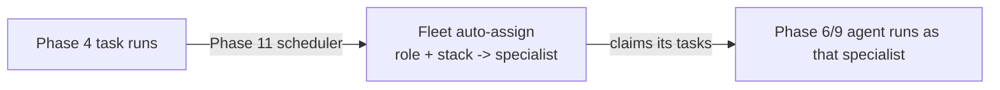
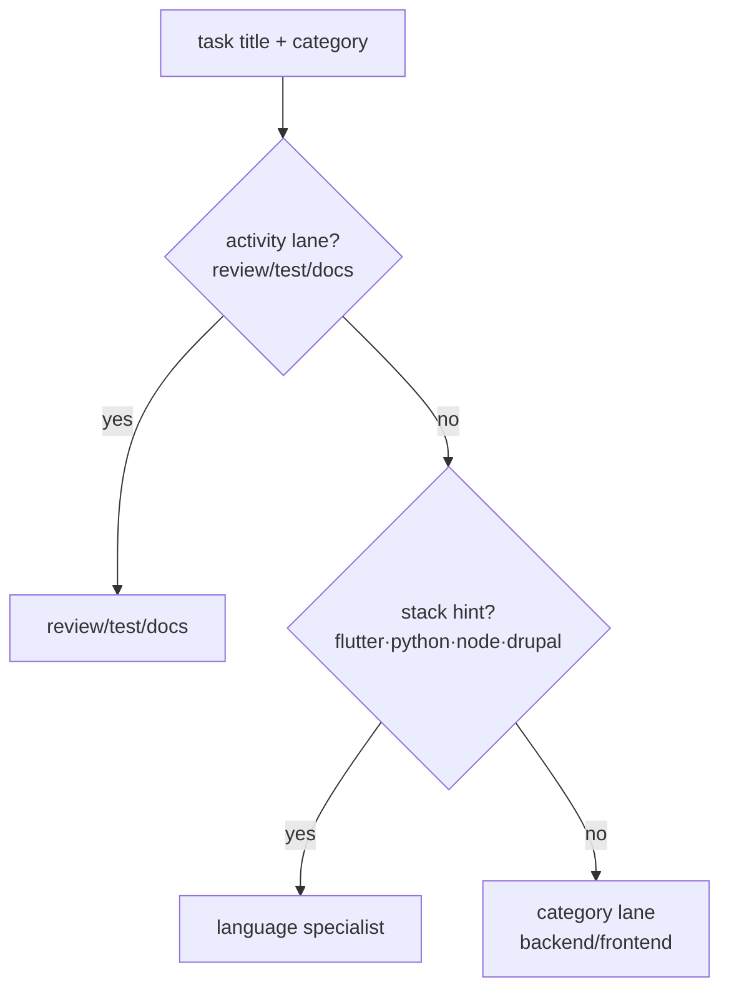

# Phase 11 — Multi-agent fleet

## Goal

Run a **fleet of specialist agents** instead of one generalist, and let a
**scheduler auto-assign** every task to the right specialist:

> Cho phép nhiều Agent → Backend · Frontend · Flutter · Python · Node · Drupal ·
> Review · Test · Docs · Planner → **Scheduler tự phân công.**

| Specialist | Role | Picks up |
|------------|------|----------|
| **Backend Agent** | `backend` | services, endpoints, business logic, database, devops |
| **Frontend Agent** | `frontend` | web UI, pages, components |
| **Flutter Agent** | `flutter` | Flutter / Dart mobile & desktop |
| **Python Agent** | `python` | Python services & scripts (FastAPI/Django) |
| **Node Agent** | `node` | Node.js / TypeScript runtimes |
| **Drupal Agent** | `drupal` | Drupal / PHP CMS |
| **Review Agent** | `review` | code review & feedback |
| **Test Agent** | `test` | test generation & QA |
| **Docs Agent** | `docs` | documentation & changelogs |
| **Planner Agent** | `planner` | planning, breakdown, orchestration |
| **Generalist Agent** | `generalist` | fallback when no specialist matches |

## Pipeline position



## How the scheduler assigns

The task's lane (`TaskCategory`) plus a lightweight **tech-stack** scan resolve
to a single specialist role; then the best active agent for that role is picked.



- **Activity lanes win** — a *Python test* goes to the Test agent, a *Flutter
  doc* goes to the Docs agent.
- **Stack beats category** — a `backend` task about *Flutter/Drupal/Python/Node*
  routes to that language specialist, not the generic Backend agent.
- Deterministic and pure (`app/application/orchestration/scheduler.py`) — same
  fleet always yields the same plan; no I/O, no model hardcoding.

## Server — `AgentFleetService`

`app/application/services/fleet.py` seeds the roster, lists it, and auto-assigns.

| Method & path | Description |
|---------------|-------------|
| `POST /api/v1/fleet/seed` | Register the specialist roster (idempotent by slug) |
| `GET  /api/v1/fleet/roster` | List active specialists |
| `POST /api/v1/fleet/bundles/{id}/assign` | Auto-assign every task run to a specialist |
| `POST /api/v1/fleet/match` | Preview routing for a free-text task |

Enqueue also stamps a `role` on each run, so specialists self-select. Seed/assign
use `fleet:manage` / `fleet:assign`; roster/match reuse `agent:read`.

## Data model (`migrations/0011_agents.sql`)

- `agent_role` enum (`backend … planner, generalist`); `agents.role` and
  `task_runs.role` columns.
- 11 default agents seeded idempotently; `fleet:manage|assign` permissions
  granted to admin/manager.

## Tests — `tests/test_fleet.py`

Stack detection picks the right specialist; activity lanes (review/test/docs)
beat language stack; selection prefers role then generalist; `assign_all` is
deterministic; seed is idempotent; `assign_bundle` routes every run and rejects
an unknown bundle. Offline via `FakeRepository`.

```bash
cd dashboard
.venv/bin/python -m pytest tests/test_fleet.py -q
```
