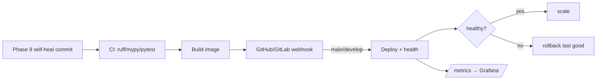

# Phase 12 — Deploy & operate

## Goal

Ship the committed, self-healed code **out** and keep it running: container build,
CI/CD, auto-deploy from GitHub/GitLab, health checks, metrics → Grafana,
rollback, backup/restore, and scale.

> Docker · CI/CD · GitHub · GitLab · Webhook · Auto Deploy · Health Check ·
> Metrics · Grafana · Rollback · Backup · Restore · Scale

| Capability | How |
|------------|-----|
| **Docker** | `dashboard/Dockerfile` (non-root, `HEALTHCHECK`), `docker-compose.yml` |
| **CI** | `.github/workflows/ci.yml`, `.gitlab-ci.yml test` — ruff · mypy · pytest |
| **CD** | `.github/workflows/cd.yml`, `.gitlab-ci.yml build/deploy` — build image, push, webhook |
| **GitHub / GitLab** | `POST /deploy/webhook` normalizes both providers |
| **Webhook → Auto Deploy** | deployable branches (`main`/`develop`) auto-deploy after green CI |
| **Health Check** | `/health`, `/ready`, `POST /deploy/deployments/{id}/health` |
| **Metrics / Grafana** | `/metrics` (Prometheus), `monitoring/` Prometheus + Grafana |
| **Rollback** | `POST /deploy/deployments/{id}/rollback` → last good release |
| **Backup / Restore** | `POST /deploy/backups`, `POST /deploy/backups/{id}/restore` |
| **Scale** | `POST /deploy/deployments/{id}/scale` (1..50 replicas) |

## Pipeline position



## How auto-deploy decides

The pipeline is pure & deterministic (`app/application/deploy/pipeline.py`): a
webhook is normalized, the branch picks the environment, only deployable
branches roll out, and versions are reproducible.

- `main`/`master` → **production**, `develop`/`staging` → **staging**, else **dev**.
- Stack/provider differences are flattened by `parse_webhook` (GitHub `after`,
  GitLab `checkout_sha`).
- `next_version(env, seq)` → `production-0001`; `image_tag` adds the short sha.

## Server — `DeployService`

`app/application/services/deploy.py`.

| Method & path | Description |
|---------------|-------------|
| `POST /api/v1/deploy/deployments` | Create a versioned deployment (manual/auto) |
| `GET  /api/v1/deploy/deployments` | List deployments |
| `POST /api/v1/deploy/deployments/{id}/health` | Record a health probe → healthy/degraded |
| `POST /api/v1/deploy/deployments/{id}/rollback` | Revert env to last good release |
| `POST /api/v1/deploy/deployments/{id}/scale` | Change replicas (1..50) |
| `POST /api/v1/deploy/webhook` | GitHub/GitLab push → auto-deploy deployable refs |
| `POST /api/v1/deploy/backups` · `/{id}/restore` | Backup & restore snapshots |
| `GET  /api/v1/deploy/metrics` | Operational counters |

Permissions: `deploy:read|write|rollback|scale|backup` (admin/manager).

## Data model (`migrations/0012_deploy.sql`)

`deployments`, `backups`, `webhook_events`; enums `deploy_status`, `deploy_trigger`,
`deploy_env`, `health_status`, `backup_kind`, `backup_status`; `deploy:*` perms; RLS.

## Observability stack

`docker-compose.yml` adds `prometheus` (scrapes `/metrics`) and `grafana`
(provisioned datasource + ops dashboard). App exposes `/health`, `/ready`,
`/metrics`. Container `HEALTHCHECK` curls `/health`.

## Tests — `tests/test_deploy.py`

Pure pipeline (branch→env, version, image tag, webhook parse, scale clamp, health,
prometheus) plus service (deploy, health flip, rollback to last good, scale,
webhook auto-deploy main only, backup/restore, metrics). Offline via `FakeRepository`.

```bash
cd dashboard
.venv/bin/python -m pytest tests/test_deploy.py -q
```
