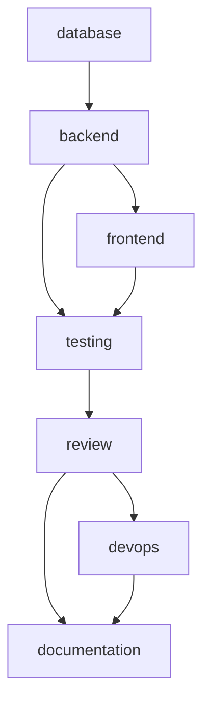

# Phase 3 — OpenSpec Generation

## Goal

Take a **ready Tech Spec** (the validated, structured output of Phase 2) and
generate a standard **OpenSpec change bundle** — a set of documents that fully
describe the change. This phase produces **documentation only; never source
code**. The `migration` document is a *suggested* DDL outline, not an executed
script.

### Generated artifacts

| Artifact | Purpose |
|----------|---------|
| `proposal` | Why the change, what changes, impact (priority/estimate/deps) |
| `requirements` | Functional + non-functional requirements, acceptance criteria |
| `tasks` | A structured, dependency-linked task DAG (consumed by Phase 4) |
| `architecture` | Context, API surface, data model, cross-cutting concerns, risks |
| `migration` | Suggested DDL outline + rollback notes (documentation) |
| `checklist` | Delivery/release gate checklist per lane |

## Design

```
tech_specs (Phase 2)
  └─ tech_spec_versions  ── latest status="succeeded" ──┐
                                                        ▼
                              OpenSpecService.generate(spec_id)
                                                        │
                              app/application/openspec/builder.py
                              (pure, deterministic renderers)
                                                        ▼
                              spec_bundles  ──1:N──  spec_artifacts
```

- **Service:** `app/application/services/openspec.py` →
  `OpenSpecService(CrudService)` (`resource="openspec"`).
- **Builder:** `app/application/openspec/builder.py` — pure functions
  (`build_bundle`, `build_tasks`) with no I/O, so output is reproducible and
  unit-testable.
- **Determinism rationale:** the AI analysis already happened in Phase 2. Phase 3
  *renders* standardized documents from that structured content, which keeps the
  artifacts consistent and the pipeline offline-testable. (Routing through the
  LLM port remains possible without changing the service contract.)

### Task DAG produced by `build_tasks`



Each task carries a stable `key`, a `category` lane, a `priority`, and a
`depends_on` list — the contract Phase 4 orchestrates.

## Data model (`migrations/0005_openspec.sql`)

- `spec_bundles(id, spec_id, spec_version, workspace_id, title, slug, status, error, …)`
  with `status ∈ {draft, generating, ready, failed}`.
- `spec_artifacts(id, bundle_id, kind, title, content, data, …)`, unique on
  `(bundle_id, kind)`. `content` is markdown; `data` holds the task DAG for the
  `tasks` artifact.
- Permissions `openspec:{read,write,delete,generate}` granted to admin/manager
  (full) and member (read). RLS read backstop for authenticated users.

## REST API

| Method & path | Description |
|---------------|-------------|
| `POST /api/v1/openspec/specs/{spec_id}/generate` | Generate a bundle from the latest (or given) ready spec version |
| `GET /api/v1/openspec/bundles` | List bundles |
| `GET /api/v1/openspec/bundles/{id}` | Bundle + artifacts |
| `GET /api/v1/openspec/bundles/{id}/artifacts` | List artifacts |
| `GET /api/v1/openspec/bundles/{id}/artifacts/{kind}` | One artifact |
| `GET /api/v1/openspec/specs/{spec_id}/bundles` | Bundles for a spec |

`POST .../generate` body: `{ "spec_version": <int|null> }` (null = latest ready).

## Failure handling

If rendering fails, the bundle is marked `failed` (with `error`), an
`openspec.failed` event is recorded, and a `GenerationError` (502) is raised.
Success records an `openspec.generated` event and a `generate` audit entry.

## Tests — `tests/test_openspec.py`

- `build_bundle` yields all six artifacts; `build_tasks` forms a valid DAG with
  every lane represented and correct dependency edges.
- `generate` creates a `ready` bundle with all artifacts and a structured tasks
  payload.
- Generation requires a `succeeded` spec version; unknown spec → `NotFoundError`.
