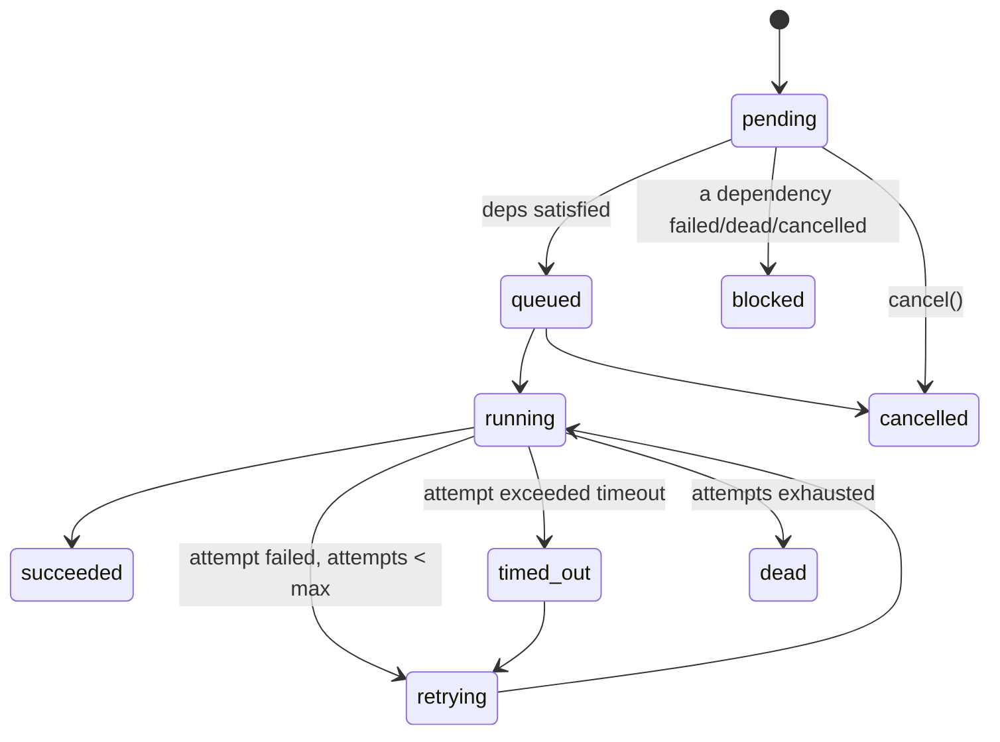

# Phase 4 — Task Orchestration

## Goal

Read the **tasks** artifact from an OpenSpec bundle (Phase 3), classify each
task into an execution lane, auto-select an agent, and run the tasks through a
scheduler that provides every required cross-cutting control.

| Requirement | How it is met |
|-------------|---------------|
| **Classify** | Keyword classifier → one of backend / frontend / database / testing / review / devops / documentation |
| **Auto-select agent** | `select_agent` matches an active agent's declared capabilities; falls back to a generalist |
| **Queue** | Tasks move `pending → queued → running` through the scheduler |
| **Retry** | Each task retries up to `max_attempts` on `ExecutionError` |
| **Timeout** | Each attempt bounded by `timeout_seconds` (per-attempt watchdog) |
| **Priority** | Ready tasks ordered `critical > high > medium > low` |
| **Dependency** | A task runs only after every `depends_on` has `succeeded` |
| **Parallel** | Independent ready tasks run concurrently up to `max_parallel` |
| **Resume** | Re-run picks up unfinished/failed tasks; succeeded work is not redone |
| **Cancel** | A task (and its now-unreachable dependents) can be cancelled |
| **Log** | Every state change / attempt writes a `task_log` + emits events |

## Components

```
app/application/orchestration/
  classifier.py   classify_category(text) · select_agent(category, agents)
  executor.py     TaskExecutor (port) · StubTaskExecutor · ExecutionError/Timeout
app/application/services/orchestrator.py
  OrchestratorService.enqueue / run / resume / cancel / list_runs / run_logs
```

- **Executor port:** the orchestrator owns scheduling/retry/timeout/deps/logging;
  the *actual* work is delegated to a `TaskExecutor`. In production this
  dispatches to an AI agent or the VS Code bridge (Phase 5); tests/local runs use
  the deterministic `StubTaskExecutor`.

## State machine (`run_state`)



Terminal states: `succeeded`, `cancelled`, `dead`.

## Scheduling algorithm (`OrchestratorService._schedule`)

1. Load all `task_runs` for the bundle; index by `task_key`.
2. Loop:
   - Compute **ready** = non-terminal tasks whose every dependency `succeeded`.
   - Any task with a failed/dead/cancelled dependency → `blocked` (skipped).
   - If nothing is ready but tasks still wait → remaining become `blocked`; stop.
   - Sort ready by priority; take up to `max_parallel`; mark `queued`.
   - Execute the batch on a `ThreadPoolExecutor`. `_execute_one` runs the
     per-task retry loop, each attempt guarded by a `timeout_seconds` watchdog.
3. Return a summary `{ total, counts: {state: n}, runs }`.

## Data model (`migrations/0006_orchestration.sql`)

- `task_runs(id, bundle_id, workspace_id, task_key, title, category, state,
  priority, depends_on, agent_id, agent_slug, attempts, max_attempts,
  timeout_seconds, payload, result, last_error, claimed_by, …)`, unique on
  `(bundle_id, task_key)`.
- `task_logs(id, run_id, level, kind, message, data, …)` —
  `kind ∈ {log, progress, commit, review, error, state}`.
- Enums `task_category`, `run_state`.
- Permissions `orchestration:{read,write,execute}` (admin/manager full, member
  read) and `agent:bridge` (for Phase 5).

## REST API

| Method & path | Description |
|---------------|-------------|
| `POST /api/v1/orchestration/bundles/{id}/enqueue` | Classify + assign + create runs |
| `POST /api/v1/orchestration/bundles/{id}/run` | Schedule & execute (`max_parallel`) |
| `POST /api/v1/orchestration/bundles/{id}/resume` | Re-run unfinished/failed tasks |
| `GET  /api/v1/orchestration/bundles/{id}/runs` | List task runs |
| `GET  /api/v1/orchestration/runs/{run_id}` | One run |
| `GET  /api/v1/orchestration/runs/{run_id}/logs` | Run logs |
| `POST /api/v1/orchestration/runs/{run_id}/cancel` | Cancel a run |

`enqueue` body: `{ max_attempts, timeout_seconds }`.
`run`/`resume` body: `{ max_parallel }`.

## Tests — `tests/test_orchestrator.py`

Covers classifier, agent selection, enqueue (idempotency guard), dependency
order, parallelism (observed max concurrency), priority ordering, retry to
success, exhausted-retries → dead + dependents blocked, timeout → dead, cancel
(+ blocked dependents and terminal-cancel rejection), resume after fix, and
per-task logging.
