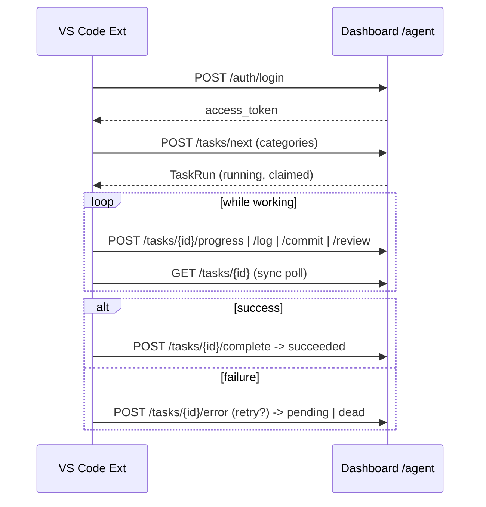

# Phase 5 — VS Code Bridge

## Goal

A VS Code extension that bridges the dashboard and the editor. It lets a
developer (or an in-editor AI coding agent) **pull** an assigned task and
**push** its results back. It is a **bridge only** — it never creates, edits, or
manages tickets, specs, or bundles.

| Capability | Bridge endpoint |
|------------|-----------------|
| Login to dashboard | `POST /api/v1/auth/login` |
| Pull task | `POST /api/v1/agent/tasks/next` |
| Push progress | `POST /api/v1/agent/tasks/{id}/progress` |
| Push log | `POST /api/v1/agent/tasks/{id}/log` |
| Push commit | `POST /api/v1/agent/tasks/{id}/commit` |
| Push review | `POST /api/v1/agent/tasks/{id}/review` |
| Push error | `POST /api/v1/agent/tasks/{id}/error` |
| Complete | `POST /api/v1/agent/tasks/{id}/complete` |
| Realtime sync | `GET /api/v1/agent/tasks/{id}` (polled) |

## Two sides

### Server — `AgentBridgeService`

`app/application/services/agent_bridge.py` operates on the Phase 4 `task_runs`
and `task_logs` tables; the router is `routers/agent_bridge.py` under `/agent`.
All operations require the `agent:bridge` permission.

- **pull_next** — selects the highest-priority `pending` task whose dependencies
  have all `succeeded` (optionally filtered by `categories`/`workspace`), claims
  it (`state=running`, `claimed_by=worker`, `attempts++`), logs and emits
  `agent.pulled`. Returns `204` when nothing is ready.
- **push_progress / push_log / push_commit / push_review** — append a typed
  `task_log` entry and emit the matching `agent.*` event. Rejected if the run is
  terminal.
- **push_error** — logs the error; if `retry` and attempts remain → back to
  `pending` (re-pullable), else `dead`.
- **push_complete** — `state=succeeded`, stores `result`, audit + event.
- **sync** — returns the run plus its recent logs (the realtime read model).

This is intentionally a *separate execution path* from the in-process Phase 4
scheduler: an external worker drives tasks by pull/push, while `orchestration/run`
drives them in-process. Both share the same state machine and tables.

### Client — `extension/` (TypeScript)

```
extension/
  package.json        commands + settings (dashboardUrl, categories, workspaceId, syncIntervalMs)
  src/api.ts          DashboardClient — REST wrapper, Bearer token, X-Workspace-Id
  src/extension.ts    commands, status bar, active-task state
  src/realtime.ts     RealtimeSync — polls GET /agent/tasks/{id}, surfaces state changes
```

- Token stored in VS Code **SecretStorage** (never in settings).
- Status bar shows the active task key + state; a poller mirrors the dashboard's
  own polling-based realtime fallback.

## Worker flow



## Build the extension

```bash
cd extension
npm install
npm run compile     # or: npm run watch ; then press F5
```

## Tests — `tests/test_agent_bridge.py`

Covers pull (claims + marks running), dependency gating, dependency-satisfied
pull, priority and category filtering, no-ready → `None`, progress/log/commit/
review entries, error-with-retry requeue vs no-retry dead, complete → succeeded,
terminal-task push rejection, and sync returning run + logs.
