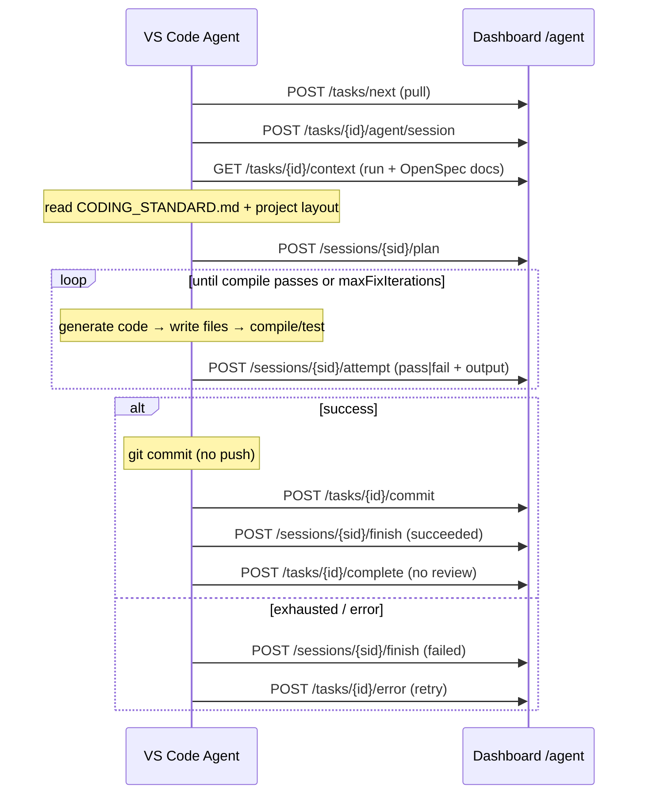
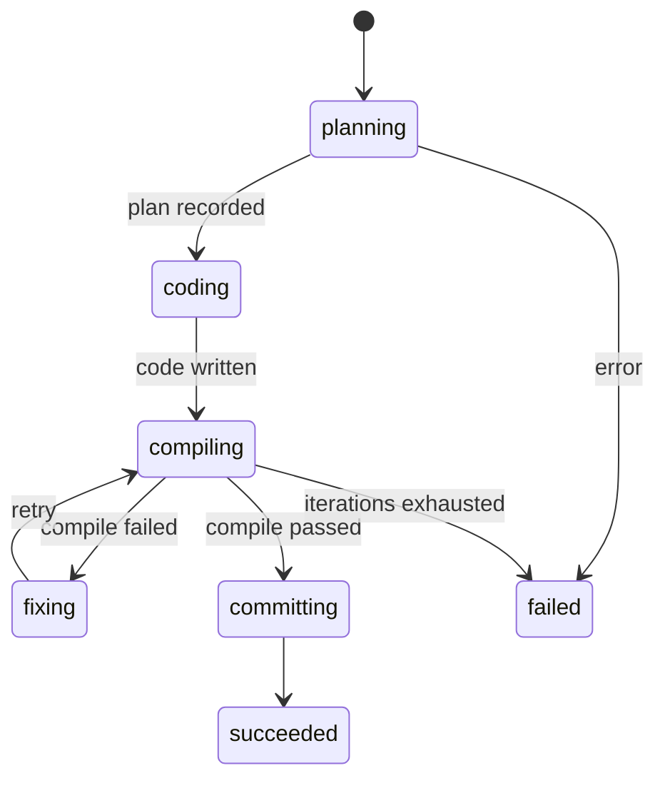

# Phase 6 — Autonomous Coding Agent

## Goal

Turn a **pulled task** into **committed code**, fully autonomously. The agent
runs inside the VS Code extension and drives a single task through one loop:

> Nhận Task → Hiểu Context → Đọc Project → Đọc Coding Standard → Đọc OpenSpecs →
> Sinh Plan → Code → Compile → Fix → Loop → Commit. **Không Review.**

| Step | What happens |
|------|--------------|
| **Receive task** | Reuses the Phase 5 bridge: pull the next ready task run |
| **Understand context** | `GET /agent/tasks/{id}/context` → run + its OpenSpec documents |
| **Read project** | Shallow scan of the open workspace folder (layout summary) |
| **Read coding standard** | A repo file (`CODING_STANDARD.md`, configurable) |
| **Read OpenSpecs** | The bundle's proposal/requirements/tasks/architecture/migration/checklist |
| **Generate plan** | VS Code Language Model API (`vscode.lm`) → `{summary, steps}` |
| **Code** | Model emits full-file edits as ```lang path=...``` blocks → written to disk |
| **Compile** | `tata.compileCommand` (+ optional `tata.testCommand`) via child_process |
| **Fix / Loop** | On failure, feed the compiler output back to the model; bounded by `tata.maxFixIterations` |
| **Commit** | One `git` commit per task on success (**no push**) |
| **No review** | The review step is intentionally skipped — straight to completion |

## Two sides

### Client — `extension/src/agent/` (TypeScript)

```
extension/src/agent/
  context.ts   gatherContext — project tree + coding standard + OpenSpec docs
  llm.ts       generatePlan / generateCode via vscode.lm; parseFileEdits
  apply.ts     applyEdits — write files, confined to the workspace folder
  compile.ts   compileAndTest — run shell commands, capture output
  git.ts       commitAll — stage + commit (never push)
  agent.ts     runAgent — the plan → code → compile → fix → commit loop
```

- **Model:** `vscode.lm.selectChatModels` (Copilot/any provider) — no API keys.
- **Safety:** writes are path-checked against the workspace root; the agent
  commits but never pushes; the fix loop is bounded.

### Server — `CodingAgentService`

`app/application/services/coding_agent.py` is the agent's memory. It serves the
task context and records the session + every attempt (all under the existing
`agent:bridge` permission). It does **not** move the task run's state — that
stays in `AgentBridgeService` (`complete` / `error`).

| Method & path | Description |
|---------------|-------------|
| `GET  /api/v1/agent/tasks/{id}/context` | Task run + its OpenSpec documents |
| `POST /api/v1/agent/tasks/{id}/agent/session` | Start a coding-agent session |
| `GET  /api/v1/agent/agent/sessions/{sid}` | Session + its attempts (read model) |
| `POST /api/v1/agent/agent/sessions/{sid}/plan` | Record the generated plan |
| `POST /api/v1/agent/agent/sessions/{sid}/attempt` | Record one loop iteration |
| `POST /api/v1/agent/agent/sessions/{sid}/finish` | Close the session (succeeded/failed) |

## The loop



## State machine (`agent_session_status`)



Terminal session states: `succeeded`, `failed`.

## Data model (`migrations/0007_coding_agent.sql`)

- `agent_sessions(id, run_id → task_runs, bundle_id, workspace_id, status,
  plan jsonb, summary, attempts_count, last_error, started_at, finished_at, …)`.
- `agent_attempts(id, session_id → agent_sessions, iteration, phase, status,
  compile_output, files jsonb, error, …)` —
  `phase ∈ {plan, code, compile, fix, commit}`, `status ∈ {pass, fail}`.
- Enums `agent_session_status`, `agent_attempt_phase`, `agent_attempt_status`.
- Reuses the Phase 5 `agent:bridge` permission (no new permission).

## Configuration (`extension` settings)

| Setting | Default | Purpose |
|---------|---------|---------|
| `tata.codingStandardPath` | `CODING_STANDARD.md` | Coding standard file the agent reads |
| `tata.compileCommand` | `""` (required) | Compile/build command |
| `tata.testCommand` | `""` | Optional verification command (must also pass) |
| `tata.maxFixIterations` | `5` | Loop bound before giving up |
| `tata.commitMessageTemplate` | `feat({category}): {task_key} {title}` | Commit message |
| `tata.autoCommit` | `true` | Commit on success (no push); off ⇒ leave staged |

## Run the agent

```bash
cd extension
npm install
npm run compile     # tsc ; then press F5 to launch the Extension Dev Host
```

In the Dev Host: **Tata: Login** → set `tata.compileCommand` →
**Tata: Run Autonomous Agent**. The agent pulls a task (if none is active),
plans, codes, compiles, fixes, and commits — reporting every step to the
dashboard.

## Tests — `tests/test_coding_agent.py`

Covers the server side: context retrieval (run + documents, missing run),
session start (+ terminal-run rejection), plan recording (→ coding + plan
attempt), attempt recording (count, status mapping, last_error), fix-phase
status, finish (succeeded/failed, invalid status, terminal-session rejection),
and the session read model (attempts in order).

The extension loop is exercised manually in the Extension Dev Host (the
`vscode.lm` / filesystem / git surface has no offline harness).

## Security notes

The agent writes AI-generated code, runs a configured shell command, and
commits — **without a human review step** (by design). Mitigations built in:
file writes are confined to the workspace folder (path-traversal guard); the
loop is bounded; commits are local only (**never pushed**); and `tata.autoCommit`
can be turned off to leave changes staged for a manual commit. Treat OpenSpec /
context text as untrusted input flowing into model prompts.
