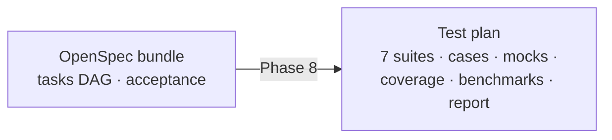

# Phase 8 — Test generation

## Goal

Turn a ready **OpenSpec bundle** into a complete, structured **test plan** —
every kind of test, plus mocks, coverage targets, benchmarks and a report:

> Sinh Test → Unit · Integration · API · Regression · Edge Case · Mock ·
> Coverage · Benchmark → Sinh Report. **Documentation only — never code.**

Like Phases 2–3, generation is **deterministic** and offline: the same bundle
always yields the same plan, so the whole pipeline stays reproducible and
testable without external services.

| Goal | What it produces |
|------|------------------|
| **Unit test** | One happy-path case per backend/frontend task |
| **Integration** | One case per task with dependencies (end-to-end wiring) |
| **API test** | One contract case per endpoint (status + schema) |
| **Regression** | One case per acceptance criterion (baseline unchanged) |
| **Edge case** | Empty / boundary / invalid input variations |
| **Mock** | Fakes for LLMClient, TaskExecutor, Repository, HTTP, DB |
| **Coverage** | Line/branch targets (default 80%) in the report gate |
| **Benchmark** | p95/throughput budgets per endpoint (`pytest-benchmark`) |
| **Report** | Markdown summary: suites, case counts, coverage + gate |

## Pipeline position



The single source of truth is the bundle's `tasks` artifact (built in Phase 3):
each task carries a key, category lane, dependency list and acceptance text, so
suites are derived from one consistent DAG — no second analysis pass.

## Server — `TestGenService`

`app/application/services/testgen.py` reads the bundle's OpenSpec documents and
persists a plan, its suites and cases. `app/application/testgen/builder.py` is
the pure, deterministic generator.

| Method & path | Description |
|---------------|-------------|
| `POST /api/v1/testgen/bundles/{id}/generate` | Generate a plan (body: `coverage_target`) |
| `GET  /api/v1/testgen/bundles/{id}/plans` | Plans generated for a bundle |
| `GET  /api/v1/testgen/plans/{id}` | Plan + suites (with cases) — the report read model |
| `GET  /api/v1/testgen/plans/{id}/suites` | Suites of a plan |
| `GET  /api/v1/testgen/suites/{id}/cases` | Cases of a suite |

## Data model (`migrations/0008_testgen.sql`)

- `test_plans(id, bundle_id → spec_bundles, workspace_id, title, slug, status,
  coverage_target, suite_count, case_count, report, error, …)`.
- `test_suites(id, plan_id → test_plans, kind, title, framework, summary, mocks
  jsonb, data jsonb)` — `unique (plan_id, kind)`.
- `test_cases(id, suite_id → test_suites, plan_id, name, given, when, then,
  kind, status)`.
- Enums `test_plan_status`, `test_kind` (7 kinds), `test_case_status`.
- New permissions `testgen:read|write|delete|generate` (admin/manager all;
  member read).

## Status

| Status | Meaning |
|--------|---------|
| `draft` → `generating` → `ready` | Successful generation |
| `generating` → `failed` | Generation error (stored on the plan) |

## Tests — `tests/test_testgen.py`

Pure builder (all 7 kinds present, mocks + benchmark budgets, coverage target in
report) and service (ready plan with suites + cases, tasks-artifact required,
unknown bundle, report read model). Offline via `FakeRepository`.

```bash
cd dashboard
.venv/bin/python -m pytest tests/test_testgen.py -q
```
