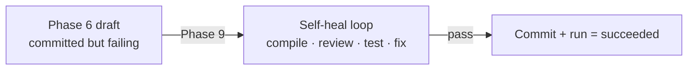
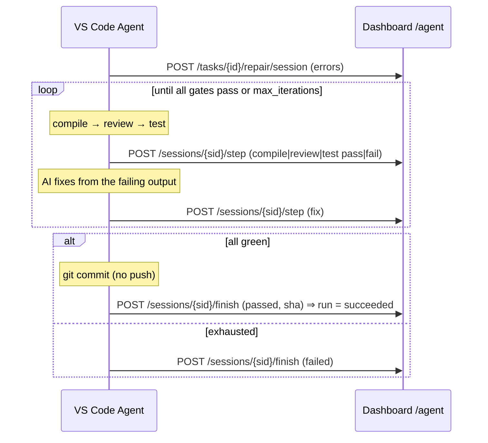
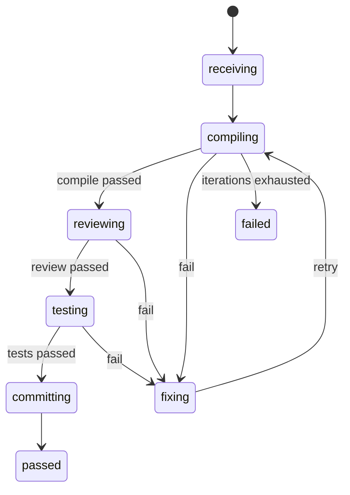

# Phase 9 — Self-healing loop

## Goal

Take a **failing task** and drive it to **green, committed code** automatically.
When the Phase 6 draft (or any later push) fails, the agent feeds the errors
back in and runs one bounded loop:

> Nhận lỗi → Compile → Review → Test → AI tự sửa → Loop → Pass → Commit →
> Update trạng thái. **The loop fixes code; the server records it.**

| Step | What happens |
|------|--------------|
| **Receive errors** | Open a repair session for a running task run with the build/test errors |
| **Compile** | Build the changed code |
| **Review** | Static/AI review gate over the diff |
| **Test** | Run the verification suite |
| **AI fix** | Feed every failing gate's output back to the model → apply a fix |
| **Loop** | Repeat compile→review→test until all green, bounded by `max_iterations` |
| **Pass** | All gates green |
| **Commit** | One `git` commit (no push) |
| **Update status** | The run flips to `succeeded`; the dashboard sees it done |

Like Phase 6 the loop runs inside the VS Code extension (it owns the compiler,
test runner and git). This server-side service is its **memory** — and the only
place the task run's terminal state is set on success.

## Pipeline position



## Server — `RepairService`

`app/application/services/self_heal.py` records the session, every gate step,
and on pass flips the task run to `succeeded`. Reuses the Phase 5 `agent:bridge`
permission (no new permission). It records but never executes anything.

| Method & path | Description |
|---------------|-------------|
| `POST /api/v1/agent/tasks/{id}/repair/session` | Receive errors → open a session |
| `GET  /api/v1/agent/repair/sessions/{sid}` | Session + its steps (read model) |
| `POST /api/v1/agent/repair/sessions/{sid}/step` | Record one gate (compile/review/test/fix/commit) |
| `POST /api/v1/agent/repair/sessions/{sid}/finish` | Pass (commit + run succeeded) or fail |

## The loop



## State machine (`repair_session_status`)



Terminal session states: `passed` (commit + run `succeeded`), `failed`.

## Data model (`migrations/0009_self_heal.sql`)

- `repair_sessions(id, run_id → task_runs, bundle_id, workspace_id, status,
  errors, summary, iterations_count, max_iterations, last_error, commit_sha,
  started_at, finished_at, …)`.
- `repair_steps(id, session_id → repair_sessions, iteration, gate, result,
  output, files jsonb, error)` — `gate ∈ {compile, review, test, fix, commit}`,
  `result ∈ {pass, fail}`.
- Enums `repair_session_status`, `repair_gate`, `repair_result`.
- Reuses `agent:bridge` (no new permission).

## Tests — `tests/test_self_heal.py`

Receive errors (+ missing/terminal run), gate stepping (compile fail records
last_error; review/test/fix advance status; unknown gate rejected), finish
(pass commits + run → succeeded, fail leaves run untouched, invalid status,
terminal-session rejection) and the session read model. Offline via
`FakeRepository`.

```bash
cd dashboard
.venv/bin/python -m pytest tests/test_self_heal.py -q
```
